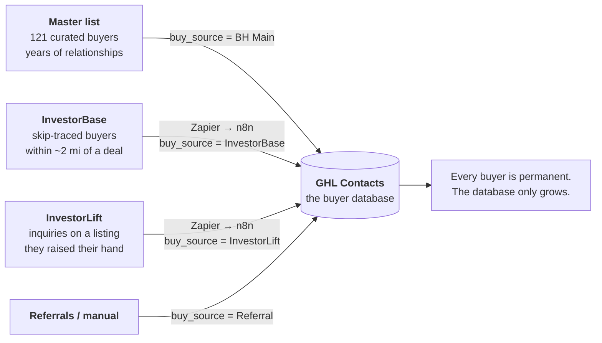
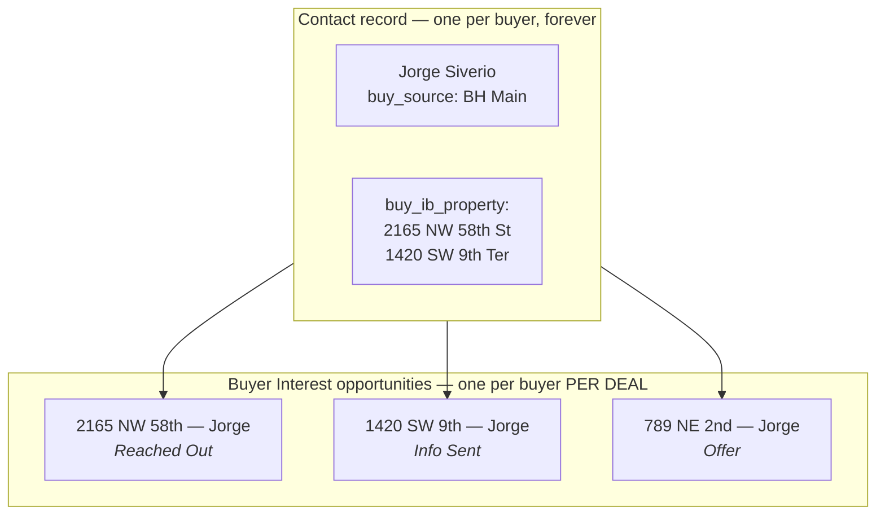
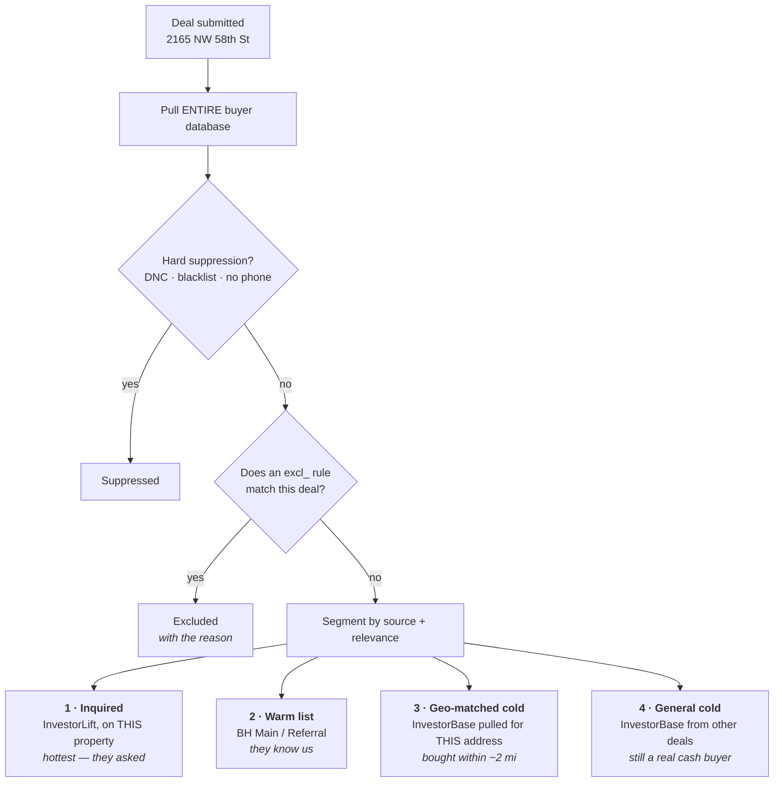
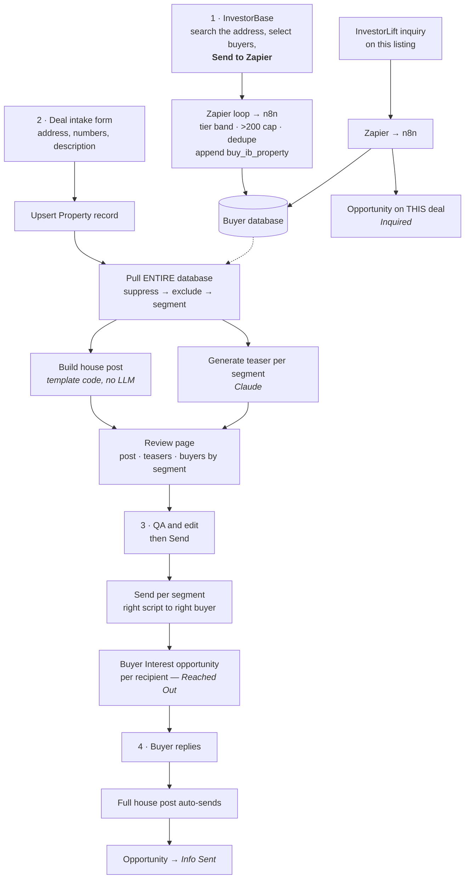

# Dispo Machine — How It Actually Works

**Companion to [`PLAN.md`](PLAN.md).** This is the map: what feeds the buyer
database, how a buyer gets tied to a deal, and who receives what.

---

## The one idea everything else follows from

> **Source decides the SCRIPT. Criteria decide the EXCLUSION.**

Every buyer in the database is a potential buyer for every deal. Where they came
from never removes them — it only changes how we talk to them.

A buyer is removed from a blast for exactly two reasons:

1. **Hard suppression** — DNC, blacklist, no phone. Compliance and physics.
2. **An `excl_` rule a human set** after talking to them — "$1M+ only",
   "Gables and Pinecrest only", "no condos".

That's it. Being an InvestorBase buyer pulled for a different property is **not**
a reason to exclude anyone. They are still a cash buyer in your county.

---

## 1. What feeds the buyer database

**The database is cumulative and shared.** Nothing is scoped to one deal. A
buyer sourced for 2165 NW 58th St is available for every deal after it.

---

## 2. How a buyer gets tied to a specific deal

Two different relationships, and conflating them is what caused the earlier
confusion:

| Relationship | Stored as | Meaning |
|---|---|---|
| **Sourced for** | `buy_ib_property` (append-only list) | InvestorBase returned them for this address. Geographic relevance only. |
| **Engaged with** | **Buyer Interest opportunity** | We contacted them about this deal, and here's how far it got. |

**The opportunity is the association.** One buyer, many deals, each with its own
independent status. A contact field can never express this — it overwrites.

To see every buyer on a deal: open the **Buyer Interest** pipeline and search the
address.

---

## 3. Segments — who gets which script

At blast time every eligible buyer lands in exactly one segment. Same deal, same
facts, different opener.

| # | Segment | Opener | Why it differs |
|---|---|---|---|
| 1 | **Inquired** | references their inquiry | They already raised their hand on this exact property |
| 2 | **Warm list** | familiar, first-name, "got another one" | Existing relationship |
| 3 | **Geo-matched cold** | leads with the neighborhood | They demonstrably buy on this street |
| 4 | **General cold** | straight, credible, AI disclosure | No relationship, no geographic hook |

Nobody is excluded for being in segment 3 or 4. **Everyone gets contacted;
segments 3 and 4 just get a colder, more careful script.**

---

## 4. The full per-deal flow

---

## 5. Traceability — what you can answer

| Question | Where |
|---|---|
| Every buyer contacted about this deal, and their status | Buyer Interest pipeline, search the address |
| Which deals has this buyer been contacted about | Buyer Interest, filter by contact |
| Which deals was this buyer sourced for | `buy_ib_property` on the contact |
| Where did this buyer come from | `buy_source` |
| Why didn't this buyer get the blast | Review page — `excluded` / `suppressed`, with the reason |
| Which buyers should we call to confirm their box | Review page — `review_suggestions` |
| What exactly did we send | `prop_teaser_sms` / `prop_sms_post` on the Property record |

---

## 6. What "exclusion" means — worked examples

Exclusions are **buy-box facts a human confirmed**, never inferred from source.

| Real buyer | Rule set | Effect |
|---|---|---|
| David Rojas — *"only $1M+ ARV or land to build"* | `excl_below_price = 1000000` | Skipped on a $335K deal, included on a $1.2M one |
| Francisco Siman — *"Gables, Pinecrest only"* | `excl_outside_neighborhoods = Coral Gables, Pinecrest` | Skipped on Homestead, included on a Gables deal |
| Conrado Martinez — *"ONLY 1,800 sq ft or bigger"* | `excl_below_sqft = 1800` | Skipped on an 805 sq ft house |
| Ralph Goicoria — *"max 315k"* | `excl_above_price = 315000` | Skipped on a $500K deal |
| Wilfredo Barrios — *"DO NOT CONTACT"* | `excl_all_blasts = Yes` | Never contacted |

> **"High end" is not a rule.** It has to be expressed as a number
> (`excl_below_price`) or a place (`excl_outside_neighborhoods`). Vague labels
> can't be enforced and silently do nothing.

**The extracted `buy_*` buy box never filters a blast.** It was parsed from old
prose notes and was never confirmed. It only produces *review suggestions* —
a call list — and the buyer still receives the deal until someone confirms.

---

## 7. Build status

| Piece | Status |
|---|---|
| Buyer database + classification fields | ✅ |
| Exclusion engine | ✅ |
| InvestorBase capture (W12) | ✅ |
| Deal intake + house post + teaser (W1) | ✅ |
| Blast + Buyer Interest opportunities (W2) | ✅ |
| **Per-segment teasers** | ⏳ replacing the source-exclusion mistake |
| **InvestorLift capture (W11)** | ❌ |
| **Reply handler (W1c)** | ❌ |
| **Deal dashboard** | ⏸ deferred — use the Buyer Interest pipeline for now |

### Deferred: the deal dashboard

**Decision 2026-08-15:** ship on the GHL Buyer Interest pipeline first. It
already answers "every buyer on this deal and their status" for free, inside the
tool the team is already in. Build the custom dashboard once a few real deals
have run through — the pipeline will show us what's actually missing rather than
what we guessed.

What a dashboard would add later: one screen per deal with the four segment
counts, reply rate, time-to-first-reply, `buy_objection_last` themes across
non-responders, and price-reduction pressure — the analytics the pipeline
board cannot show.

---

## Correction log

**2026-08-15 — source-based exclusion was wrong.** InvestorBase buyers sourced
for a different property were being excluded from every other deal. That throws
away the database the imports exist to build. Replaced with segmentation:
everyone is contacted, source only selects the script.
